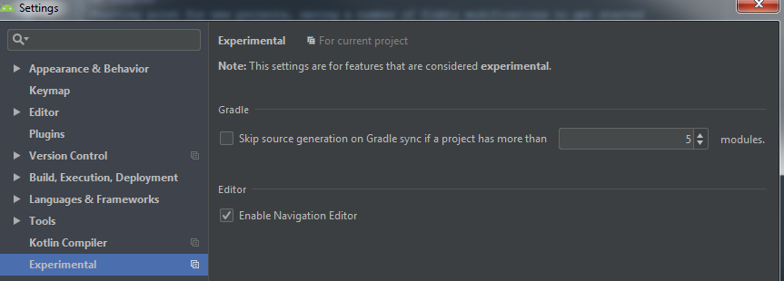
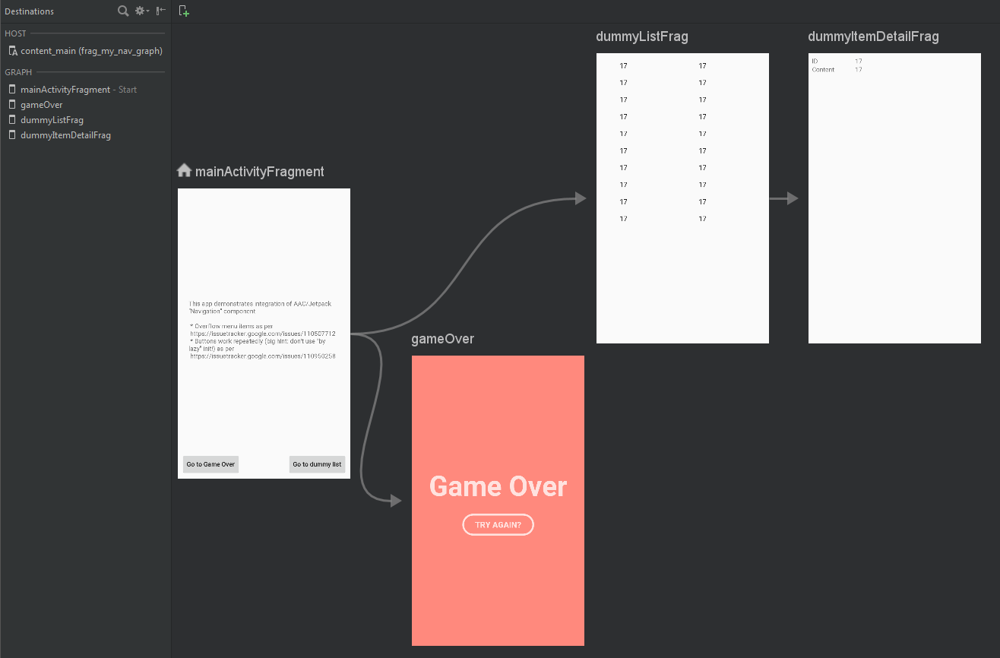
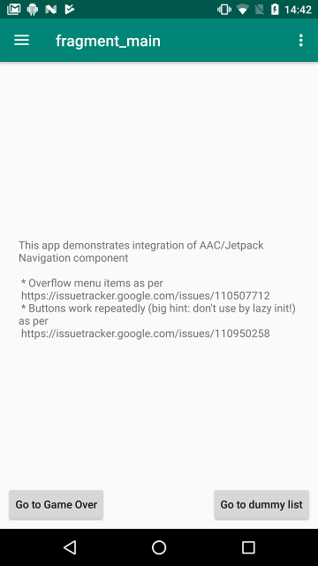
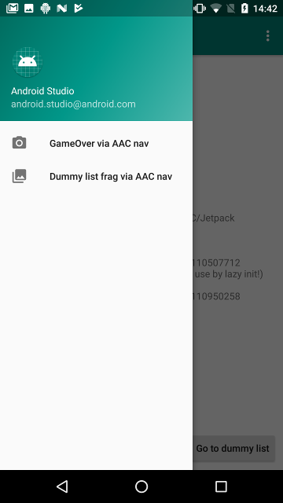
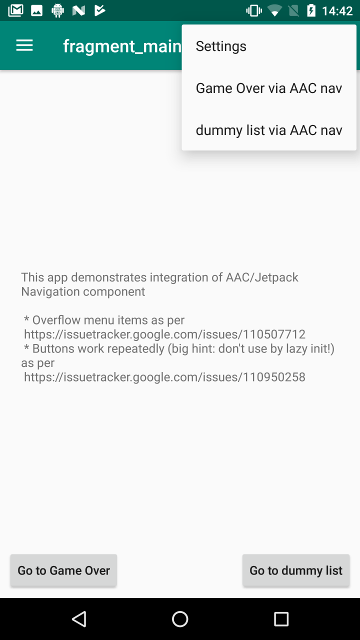

# AACNavTemplate
Template "Navigation Drawer" application integrating AAC/Jetpack "Navigation" component

## Introduction

### AndroidX
Now uses AndroidX, better interoperability with wizard projects and components (activites, fragments)
from Android Studio "New" menu

### Purpose
Starting point for new projects, saving a number of fiddly modifications to get started
with AAC/Jetpack "Navigation" component

## Prerequisites
As of Android Studio 3.2 Beta 2, need to explicitly enable experimental AAC/Jetpack "Navigation" component in settings

## Navigation graph
A very simple navigation graph with a simple dummy "Game Over" fragment, and dummy list/detail fragment pair.

## Same (dummy) destinations available from...
The dummy destinations can be reached from any of three flows:

### Buttons (on main screen)

### Nav drawer

### Overflow menu

Should be able to repeatedly navigate to the destinations and up/back to main screen
via any or all of the three flows (buttons, nav drawer, (overflow) menu)
